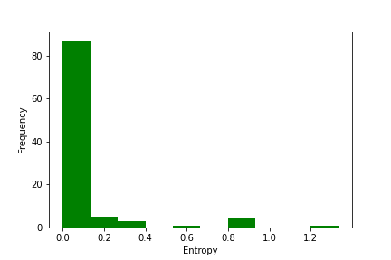
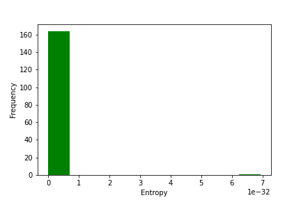
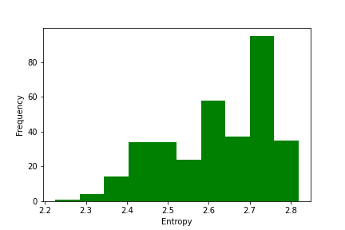
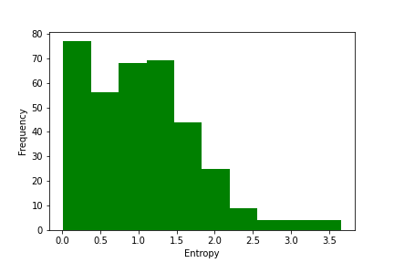
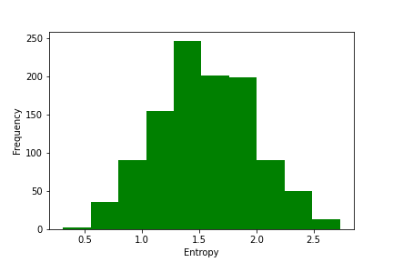
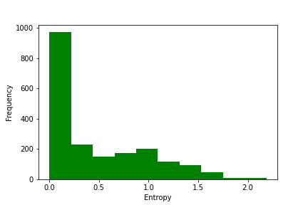
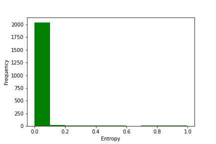
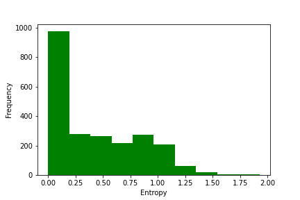
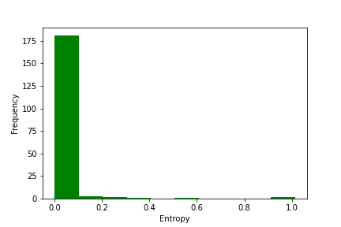
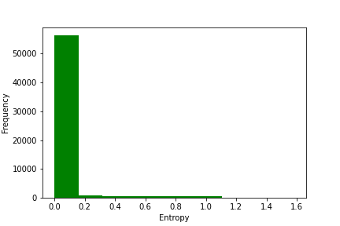

  <figure>
    
    <figcaption>Zoo<figcaption>
  </figure>
  <figure>
    
    <figcaption>Yale</figcaption>
  </figure>
  <figure>
    
    <figcaption style="text-align:right;">Ecoli</figcaption>
  </figure>

  <figure>
    
    <figcaption style="text-align:right;">Zoo</figcaption>
  </figure>
  <figure>
    
    <figcaption style="text-align:left;">Yale</figcaption>
  </figure>
  <figure>
    
    <figcaption style="text-align:left;">Ecoli</figcaption>
  </figure>

<!-- 

  
  
  

 -->

<!-- 

  
  
  

  
  
  
  

 -->

In terms of deeper analysis, we also compute the distribution of the entropy of the softmax in the AM update equation (4) for the selected $\beta$ after the ClAM training, and see that, across multiple datasets, the entropy distribution spikes at zero, indicating that, for most points, the softmax puts all the probability mass on the closest prototype, which is the desired behavior.