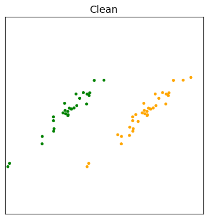
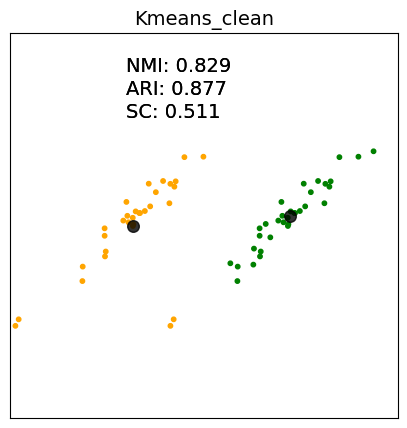
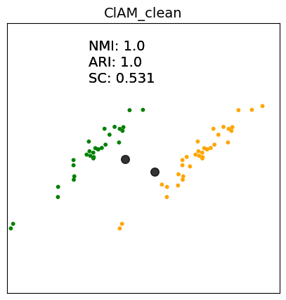
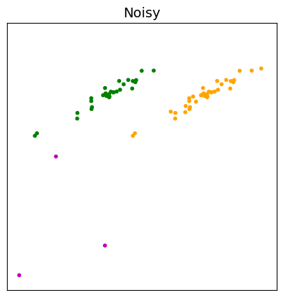
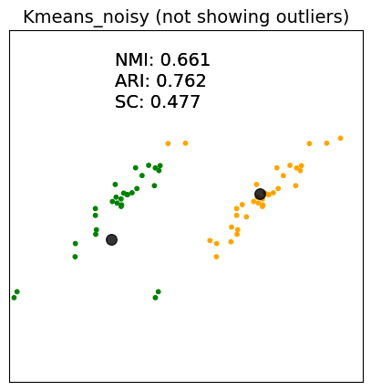
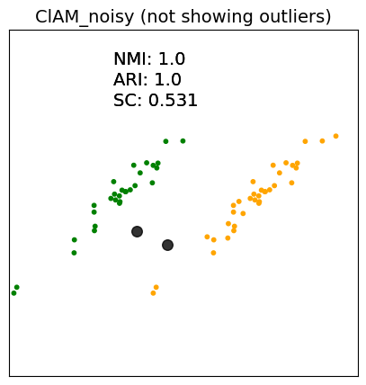

<!-- 

  
  
  

  
  
  

 -->

  
  
  

  
  
  

For the purpose of this experiment, we first add outliers to an example dataset. Clean.png refers to the original dataset and Noisy.png refers to
the dataset with outliers (which are shown in magenta color).

Next, we run both Kmeans and ClAM on the both the original and noisy datasets (Kmeans_clean.png and ClAM_clean.png refer  to the results on the
original dataset, and Kmeans_noisy.png & Clam_noisy.png refer to the results on the noisy dataset).

We then compute the clustering quality via SC/NMI and ARI metrics. However, for the noisy dataset, we compute the metrics only on the inliers
(i.e., excluding the outliers), to see how much the outliers affect the clustering quality of the actual inliers.

<!-- 
 -->